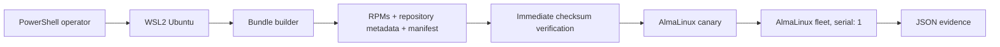

# AirGap Patch Orchestrator

[](https://github.com/RedBeret/airgap-patch-orchestrator/actions/workflows/ci.yml)
[](LICENSE)
[](requirements-dev.txt)

Lab for building, verifying, and applying RPM patch bundles to disconnected
RHEL-compatible servers. It supports a Windows PowerShell entrypoint and a native
WSL shell workflow. WSL2 hosts the Ansible control environment, and three disposable
AlmaLinux containers act as the managed fleet.

The default action is read-only assessment. Package changes require an explicit
`-Apply` switch, a bundle that passes verification immediately before transfer,
and a successful canary run.

## What the lab demonstrates

- a Windows-to-WSL Ansible workflow
- deterministic RPM bundle manifests
- rejection of missing, modified, and unexpected files
- an offline-only DNF transaction with all other repositories disabled
- canary-first, one-host-at-a-time rollout
- disk, operating system, reboot, and service-port checks
- JSON evidence for assessment and patch runs
- removal of temporary repository configuration and transferred RPMs
- an unchanged package transaction when the patch playbook is repeated

The small demo bundle contains `tzdata` and its resolved dependencies so the
workflow stays quick to run. It is not presented as a current security advisory.
A production security bundle needs vendor `updateinfo` metadata and an approved
advisory-selection process.

## Architecture



## Requirements

- Windows 10 or 11
- PowerShell 7
- WSL2 distribution named `Ubuntu`
- Docker available inside that WSL distribution
- Docker Compose v1 or v2
- Python 3.10 or newer in WSL

Docker Desktop with Ubuntu WSL integration is the simplest setup. The scripts do
not install or reconfigure WSL, Docker, or system packages.

## Quick start from Windows

Run these commands from PowerShell in the repository root:

```powershell
pwsh ./scripts/bootstrap.ps1
pwsh ./scripts/lab.ps1 -Action Up
pwsh ./scripts/lab.ps1 -Action Assess
```

`bootstrap.ps1` creates a project-local Python environment and a lab-only SSH key.
`Up` builds three AlmaLinux SSH targets bound to local ports `2221` through `2223`.
`Assess` queries the lab targets' normal AlmaLinux repositories and writes reports
under `reports/`.

Build and apply the portable demo repository:

```powershell
pwsh ./scripts/lab.ps1 -Action BuildBundle
pwsh ./scripts/lab.ps1 -Action VerifyBundle
pwsh ./scripts/lab.ps1 -Action Patch -Apply
pwsh ./scripts/lab.ps1 -Action Down
```

## Quick start from WSL

Clone into the Linux filesystem for the fastest development loop:

```bash
mkdir -p ~/development/CodexWorkspace
cd ~/development/CodexWorkspace
git clone https://github.com/RedBeret/airgap-patch-orchestrator.git
cd airgap-patch-orchestrator
./scripts/bootstrap.sh
./scripts/lab.sh doctor
./scripts/lab.sh up
./scripts/lab.sh assess
```

Build and apply the demo bundle from WSL:

```bash
./scripts/lab.sh build-bundle
./scripts/lab.sh verify-bundle
./scripts/lab.sh patch --apply
./scripts/lab.sh down
```

Both interfaces call the same Ansible playbooks and write the same artifacts.

The patch action verifies the bundle again, copies it to the target, disables every
configured DNF repository except the copied bundle, patches the canary, checks SSH,
only then continues through the remaining hosts, and removes temporary patch content.

## Commands

| Command | Purpose | Changes targets? |
| --- | --- | --- |
| `bootstrap.ps1` | Create the WSL Python environment and lab SSH key | No |
| `bootstrap.sh` | Create the environment and key from native WSL | No |
| `lab.ps1 -Action Up` | Build and start three disposable targets | Creates containers |
| `lab.ps1 -Action Assess` | Collect available security advisory data | No |
| `lab.ps1 -Action BuildBundle` | Download a small demo RPM set and build metadata | No |
| `lab.ps1 -Action VerifyBundle` | Recompute and compare every bundle checksum | No |
| `lab.ps1 -Action Patch -Apply` | Run the canary and serial offline patch workflow | Yes |
| `lab.ps1 -Action Test` | Run unit and Ansible syntax tests | No |
| `lab.ps1 -Action Doctor` | Check dependencies, Docker, Ansible, and lab keys | No |
| `lab.ps1 -Action Status` | Show disposable target status | No |
| `lab.ps1 -Action Down` | Remove the disposable targets and network | Removes containers |

From WSL, use the lowercase action names shown in the quick start. `build-bundle`
and `verify-bundle` also accept their compact forms, `buildbundle` and
`verifybundle`.

## Safety controls

- The inventory contains only `127.0.0.1` and the three published lab ports.
- Patch approval defaults to false in Ansible variables and in the PowerShell wrapper.
- Verification runs immediately before every transfer; a stale marker is insufficient.
- The DNF transaction uses `disablerepo: "*"` and enables only the copied repository.
- Hosts are processed with `serial: 1`, with the canary in a separate fatal play.
- Reboots are detected but disabled by default.
- Temporary repository configuration and transferred RPMs are removed in an `always` block.
- The lab SSH private key and generated bundles/reports are ignored by Git.
- Image builds generate unique SSH host keys when each container starts.

Host-key checking is disabled in `ansible.cfg` because these targets are disposable
and recreated with new keys. Do not carry that setting into a production inventory.

Checksums protect against accidental corruption. They do not authenticate who built
the bundle. A production deployment must verify a detached signature using a public
key already trusted on the isolated side.

## Bundle format

Generated content is written to `bundles/demo/` and is not committed:

```text
bundles/demo/
├── manifest.json
├── RELEASE_NOTES.md
├── .verified
└── packages/
    ├── *.rpm
    └── repodata/
```

The manifest records the platform, purpose, and SHA-256 digest of every regular
bundle file. Verification fails on path traversal, checksum mismatch, missing files,
or files not declared in the manifest.

## Evidence

Assessment and patch records are written to `reports/`:

```text
reports/
├── patch-canary-assessment.json
├── patch-canary-patch.json
├── patch-app01-assessment.json
├── patch-app01-patch.json
├── patch-app02-assessment.json
└── patch-app02-patch.json
```

Patch evidence records the preflight platform and kernel, package transaction result,
reboot recommendation, reboot policy, final kernel, and checked service ports.

## Testing

From PowerShell:

```powershell
pwsh ./scripts/lab.ps1 -Action Test
```

From WSL:

```bash
./scripts/lab.sh test
```

The unit suite covers a valid round trip plus corrupted content, unexpected files,
path traversal, stale verification, and manifest invalidation. GitHub Actions runs
the unit suite, Ansible syntax checks, and `ansible-lint` on every pull request.

The full Windows integration sequence is:

```powershell
pwsh ./scripts/lab.ps1 -Action Up
pwsh ./scripts/lab.ps1 -Action Assess
pwsh ./scripts/lab.ps1 -Action BuildBundle
pwsh ./scripts/lab.ps1 -Action Patch -Apply
pwsh ./scripts/lab.ps1 -Action Down
```

## Lab boundary and production path

The initial assessment step uses the containers' connected AlmaLinux repositories so
the lab can display real advisory data. The patch transaction itself uses only the
copied bundle. A genuinely disconnected assessment requires the imported repository
to retain vendor `updateinfo` metadata.

For RHEL, build from entitled BaseOS and AppStream repositories and follow the
applicable Red Hat subscription terms. Do not publish Red Hat RPMs in this repository.

Before using the workflow outside a lab, add detached signature verification, change
approval, application-specific health checks, snapshot orchestration, secret
management, an artifact-retention policy, and a tested recovery runbook. See
[the production security workflow](docs/production-security-workflow.md).

Package downgrade is not treated as a universal rollback mechanism. Recovery should
use workload-appropriate VM or LVM snapshots, application backups, or rebuild
procedures that have been tested in advance.

## Repository layout

```text
.github/workflows/       pull-request validation
ansible/                 inventory, playbooks, and roles
docs/                    production design notes
lab/                     disposable AlmaLinux SSH targets
patchctl/                dependency-free manifest tooling
scripts/                 PowerShell and WSL entrypoints
tests/                   verifier and safety tests
bundles/                 generated bundles, ignored except for .gitkeep
reports/                 generated evidence, ignored except for .gitkeep
```

## License

MIT

See [CONTRIBUTING.md](CONTRIBUTING.md), [SECURITY.md](SECURITY.md), and the
[changelog](CHANGELOG.md) for project policies and release history.
